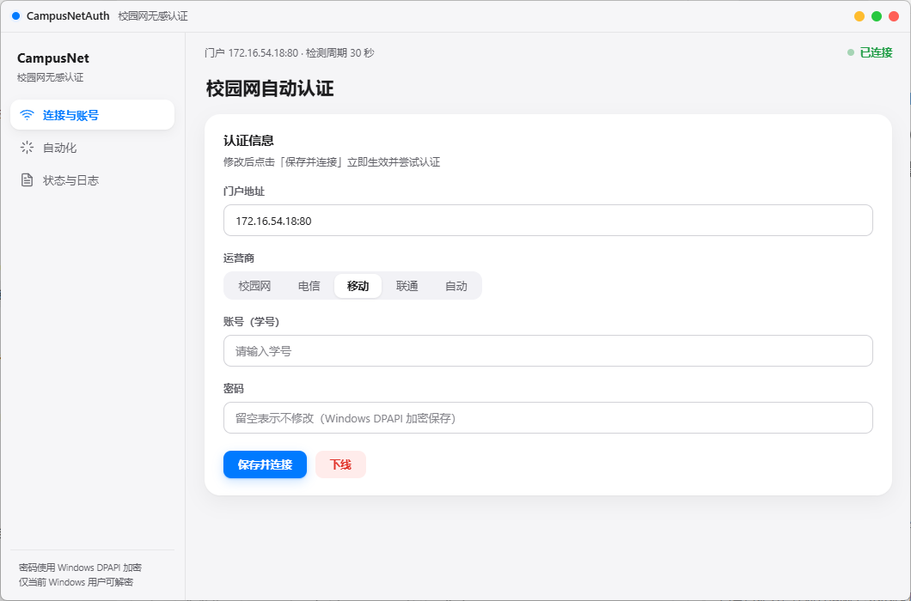

# 校园网无感认证 · CampusNetAuth


> **校园网自动认证征召**
>
> 校园网，我们的家园。
> 通畅，联网。
> “你好啊！”
> 网络，我们的生存正道。
> “噢，你好！”
>
> 但网络，也有代价。
>
> *（弹窗跳认证页面）*
> “不，我的便捷认证啊 —— 不 ——！！！”
>
> **【认证入侵】**
>
> 哈哈，觉得眼熟？
> 这样的场景，此时此刻，全校园各处都在上演！
> 下一个，可能就是你。
>
> 除非，你做出生命中最重要的决定。
> 向自己证明，你拥有摆脱手动认证的力量与勇气！
> 加入…… 自动认证程序！
> 成为精英自动认证者！
> 消灭各式各样的网页弹窗！
> 将免手动认证的便利，传遍整个校园！
>
> 成为英雄！
> 成为传奇！
> 成为自动认证使用者！

开机自动登录校园网，断线静默重连，全程无窗口、无弹窗、无感知。
针对本机门户 `http://172.16.54.18/`（**锐捷 ePortal / SAM+**）逆向适配，运行时零第三方依赖。

> **声明**：本仓库代码全部由 AI 编写，阅读源码时请谨慎（你可能会感到红温）。
> 参与 AI：**DeepSeek V4 Flash**（主要代码）· **DeepSeek V4 Pro**（精细修理）· **Hy4 Preview**（部分精细修理）

---

## 面向校园

**湖北工业大学 iHBUT**（Hubei University of Technology）校园网。
注意与河北工业大学缩写相同（均为 HBUT），本项目统一写作 **iHBUT**，勿混用。

## 功能特性

- **无感认证**：开机自启 → 后台守护 → 断线自动重连，全流程免干预
- **秒级响应**：事件驱动守护，网络变化 / 被踢下线 / 登录假成功均即时触发
- **单文件交付**：一个 exe = 管理界面 + 后台守护 + 命令行工具，免安装 Python
- **组件化安装**：开机自启 / 值守 / 界面启动器三个组件按需安装、可卸载
- **自绘现代 UI**：Apple 风格毛玻璃界面，无边框、无黑窗，支持拖拽与 Aero Snap
- **凭据安全**：密码经 Windows DPAPI 加密，绑定当前用户，文件被拷走也无法解密
- **零第三方依赖**：运行时零第三方库，打包后无需任何 Python 环境

## 系统要求

- **Windows 10 / 11**（x64），需 [Microsoft Edge WebView2 运行时](https://developer.microsoft.com/microsoft-edge/webview2/)（Windows 11 与多数 Windows 10 已内置）
- 仅限 **湖北工业大学 iHBUT** 校园网内使用：程序只在门户 `172.16.54.18` 可达时动作，校外静默待命
- 免安装 Python、免管理员权限（开机自启走当前用户注册表 Run 键）

## 快速开始（单 exe 版）

| 步骤 | 操作 | 说明 |
|---|---|---|
| 1 | 双击 `CampusNetAuth.exe` | 打开无边框管理界面（自绘标题栏，可拖拽/最小化/最大化/关闭） |
| 2 | 界面里填账号密码 →「保存并连接」 | 立即认证 |
| 3 | 进入「自动化 → 工具箱 → 安装开机自启」 | 后台守护 + 开机自启，全部在 UI 内完成 |

> **首次使用建议先在 UI 工具箱点「一键体检」**：会真实断网一次验证自动重连是否可用，
> 全过程约 1 分钟，结果写入 `campusnet.log`；或命令行 `CampusNetAuth.exe test` 查看环境。

## 命令一览

> 打包版用 `CampusNetAuth.exe`；源码开发态用 `python campusnet.py`，命令完全一致。

| 命令 | 作用 |
|---|---|
| （无参） | 打开图形管理界面（双击即用） |
| `setup` | 交互式配置（门户地址、账号、服务、密码） |
| `install` / `uninstall` | 安装 / 移除开机自启（注册表 Run 键 → VBS 静默启动） |
| `start` / `stop` | 启动 / 停止后台守护 |
| `daemon` | 前台运行守护（调试用） |
| `once` | 检测一次，未认证就登录一次（可配合任务计划定时轮询） |
| `login` / `logout` | 立即登录（`--force` 已在线也重登）/ 下线 |
| `status` | 查看状态：是否在线、服务、自启与守护进程状态 |
| `log [-n N]` | 打印最近 N 行日志（UTF-8 读取，不乱码） |
| `test` | 自检：RSA、门户连通、登录页获取 |

## 管理界面



HTML 现代 Web 风格（本地 HTTP 服务 + 原生 Edge WebView2 窗口，单进程零额外依赖）。
窗口无边框自绘：顶部毛玻璃标题栏、Apple 交通灯式按钮，
按住标题栏任意位置可拖动，双击切换最大化，边缘可拖拽调大小，支持 Aero Snap。
若 pywebview / WebView2 不可用（异常环境），自动回退 tkinter 版（`ui.py`），功能不变。

| 分页 | 可设置 |
|---|---|
| **连接与账号** | 门户地址、运营商（校园网/电信/移动/联通/自动）、账号、密码，立即连接或下线 |
| **自动化** | 开机自动认证开关；守护进程管理（状态与 PID、启停/重启）；组件管理（三组件按需装/卸，卸载有确认对话框）；检测周期、重试间隔、退避上限、超时；工具箱（自检 / 一键体检 / 打开目录 / 抓取诊断） |
| **状态与日志** | 实时网络状态、账号、服务、IP、自启与守护状态，刷新 / 立即检测 / 下线，深色终端风格日志区 |

细节约定：

- 密码输入默认掩码，可点「显示」临时查看；保存走 **Windows DPAPI** 加密，界面不回显已保存密码（留空即不修改）。
- 联网操作均在后台线程执行，按钮禁用并显示旋转进度指示，不卡窗口；提示用界面内气泡通知，不用系统弹窗。
- **守护只在 iHBUT 校园网内动作**：每次循环先探测门户（`172.16.54.18`）是否可达，不可达（家里/热点/公共 WiFi）就静默等待、绝不尝试认证；只有门户可达且未认证时才自动登录。
- **单文件便携 + 组件按需安装**：交付物只有 `CampusNetAuth.exe`，在「自动化 → 组件管理」点击安装才释放对应文件（自启组件放 `CampusNetAuthDaemon.vbs` 并写 Run 键；值守组件释放同一 vbs 启动器，不再复制 exe 副本；界面启动器组件放 `CampusNetAuthUI.vbs`）。全新部署且目录非空时提醒一次"建议放入空文件夹"。
- 所有配置文件放在 exe 所在目录（`config.json` / `cred.bin` / `state.json` / `daemon.pid` / `campusnet.log`），整个文件夹拷走即迁移。
- 首次启动约 10~15 秒（onefile 解压 + WebView2 初始化），二次启动更快；需要 Edge WebView2 运行时（Windows 10/11 自带）。

## 配置文件 `config.json`

| 字段 | 默认 | 说明 |
|---|---|---|
| `portal_host` | `172.16.54.18` | 门户地址 |
| `portal_port` | `80` | 端口 |
| `portal_base` | `/eportal` | 门户接口路径前缀 |
| `username` | （空） | 学号（`config.example.json` 里为示例 `1234567890`） |
| `service` | `default` | 服务：`default`校园网 / `DX`电信 / `YD`移动 / `LT`联通 / `auto`自动 |
| `interval` | `30` | 在线时的检测周期（秒），即掉线后最长多久自动重连 |
| `retry_interval` | `30` | 登录失败后的重试间隔，指数退避 |
| `max_interval` | `600` | 退避上限（秒） |
| `offline_interval` | `60` | 网络完全不可达时的检测周期 |
| `timeout` | `8` | 单次 HTTP 超时（秒） |
| `probe_timeout` | `3` | 连通性/门户探测超时（秒），网络差时快速判定 |
| `keepalive_interval` | `300` | 在线续约会话间隔（秒），防认证过期被踢 |
| `verify_interval` | `5` | 登录成功后即时确认等待（秒）：防网关"假成功" |
| `recheck_interval` | `30` | 校外/断网退避期间的环境快探间隔（秒），网络恢复即时响应 |
| `detect_targets` | 3 个 | 连通性检测目标（HTTP，避免 HTTPS 证书干扰） |
| `log_level` | `INFO` | 日志级别 |

密码**不写进** `config.json`，单独用 **Windows DPAPI** 加密存 `cred.bin`，
只有当前 Windows 用户能解密，换用户/换机器自动失效。
仓库提供 `config.example.json` 模板，复制为 `config.json` 后填写自己的账号即可。

## 工作原理（逆向结论）

| 环节 | 结论 |
|---|---|
| 门户类型 | 锐捷 ePortal（SAM+），接口前缀 `/eportal/InterFace.do?method=` |
| 登录接口 | `POST /eportal/InterFace.do?method=login` |
| 在线检测 | 访问外网 HTTP 目标，被 302 到门户即为未认证 |
| 登录页获取 | 跟随该 302，页面隐藏字段含 RSA 公钥 |
| 密码明文 | `<密码> + ">" + <queryString 里的 mac>` |
| 加密流程 | 明文整体**反转** → **教科书 RSA**（无 PKCS#1 填充，16-bit 小端分块打包） |
| RSA 公钥 | 登录页 `publicKeyExponent` / `publicKeyModulus`，**每次登录动态读取** |
| 参数编码 | 每个字段 `encodeURIComponent` **两次** |
| 状态接口 | `getOnlineUserInfo` / `pageInfo` / `getServices` / `keepalive` |

### 为什么可信

RSA 加密是这套协议里唯一容易写错的地方（无标准填充，字节打包方式特殊）。
已用 **Node 执行门户官方 `security.js`** 与本地 Python 实现逐字节对拍：

```
[1] 'Test@123456>7AB3405C36D0'            一致
[2] 'abc123>'                             一致
[3] 'a'                                   一致
[4] '1234567890>7AB3405C36D0'             一致
[5] 'P@ssw0rd!#$%^&*()>00-11-22-33-44-55' 一致
[6] 'x'*126  (刚好一块，不补零)             一致
[7] 'y'*127  (跨块)                        一致
```

（对拍临时脚本未随仓库分发；`probe/` 只保留抓包证据脚本。）
仓库内可随时用内置自检复核 RSA 正向加密：`CampusNetAuth.exe test`
（或开发态 `python campusnet.py test`）——用一组固定 1024-bit 密钥跑
`eportal_rsa_encrypt`，并顺带检查门户连通性与在线状态。

## 即时响应机制

守护被设计为"事件驱动 + 秒级响应"，三类机制协同工作：

1. **未认证当轮立即认证**：`check_online()` 返回未认证 → 当轮零等待调用 `login()`，
   不进入任何退避（打开校园网浏览器 → 下一秒就通）。
2. **状态变化秒级发现**：

   | 场景 | 旧延迟 | 新机制 |
   |---|---|---|
   | 断网重连 / WiFi 切换 / 从校外回校 | ≤30s 轮询 | **秒级**：`NotifyAddrChange` 监听网络地址变化，通知守护立即复核 |
   | 在线期被踢下线（IP 不变） | ≤30s | 30s 轮询 + `keepalive` 失败复核兜底 |
   | 登录后假成功 | ≤30s | **5s 内复核**：`verify_interval` 短等后立即确认，未通则当轮补登 |
   | UI 手动操作 | ≤30s | **秒级**：UI 发 `CHECK` 唤醒等待中的守护 |

3. **状态事件即时反馈**：守护状态翻转写入 `state.json` 的 `events` 环形缓冲
   （最近 8 条，同 kind+msg 60s 内去重），前端"最近动态"卡片展示最近 3 条。

### 实现要点

- **CHECK / STOP 协议**：`127.0.0.1:47667`（单例锁端口），守护用 `select` 监听
  socket 数据（替代 `time.sleep`），`STOP`=优雅退出、`CHECK`=立即复核一轮。
- **自启链路容错**：vbs 启动器内置 `On Error Resume Next` + `FileExists` 前置检查，
  失败写 `autostart.log` 后静默退出（根治 80070002 弹框）。
- **自启健康检查**：`autostart_health()` 解析 HKCU Run 键 → 校验启动器与 exe 是否齐全，
  前端在自启启用但链路残缺时显示红色警示条；安装前也做前置校验，杜绝残缺自启。
- **退出临时目录清理**：单文件 exe 退出时 PyInstaller 清理 `%TEMP%\_MEIxxxx`
  可能因 WebView2 子进程占用而弹 "Failed to remove temporary directory"——
  已双管齐下：退出前等待本程序 WebView2 子进程结束 + 每次启动自动清扫超 1 小时的
  `_MEI*` 残留（见 `desktop.py` / `campusnet.py`）。

## 目录结构

```
campus-net-auth/
├─ CampusNetAuth.exe        主程序（单 exe，双击=界面 / daemon 参数=守护 / CLI 子命令）
├─ CampusNetAuthUI.vbs      静默启动界面脚本（无黑窗，「界面启动器组件」释放）
├─ CampusNetAuthDaemon.vbs  守护静默启动器（无黑窗，「值守/自启组件」释放）
├─ campusnet.py             主程序源码（开发态用，零依赖）
├─ desktop.py               HTML 界面桌面壳（pywebview + Edge WebView2，优先启动）
├─ gui_server.py            HTML 界面后端（零第三方依赖 HTTP 服务 + 内嵌前端）
├─ ui.py                    tkinter 界面源码（HTML 界面不可用时的回退）
├─ e2e_test.py              端到端测试脚本
├─ config.json              配置（不含密码，自动生成）
├─ config.example.json      配置模板（发布仓库用，账号为占位符）
├─ cred.bin                 DPAPI 加密的密码（自动生成）
├─ state.json               最近一次登录的会话 ID（自动生成）
├─ campusnet.log            日志（自动生成）
├─ 管理界面.bat / 一键测试.bat / 安装.bat / 卸载自启.bat / 查看状态.bat / 抓取诊断.bat
├─ build_exe.bat            一键重新打包（--onefile --windowed）
└─ probe/                   逆向抓包证据脚本 capture_probe.py
```

## 构建（开发者）

双击 **`build_exe.bat`** 一键重建。内部 `python -E -S _pyinst_wrap.py` 启动
PyInstaller，产物在 `dist\CampusNetAuth.exe`（fresh build），随后复制到项目根。

`_pyinst_wrap.py` 的存在原因：本项目的开发环境（WorkBuddy）会在 `sitecustomize`
中劫持 `os.remove` 到回收站 API，导致 PyInstaller `--clean` 阶段失败但静默退出
（看似成功、`dist/` 却为空）。`-E -S` 跳过 site.py 使劫持不生效，wrapper 再手动
把 venv 的 site-packages 加回 `sys.path`。

日志在 `campusnet.log`，排障先看它。

### 关于中文编码（改 `.bat` 前必读）

所有中文文案**只放在 Python 文件里**（UTF-8），**不要往 `.bat` 里写中文**——
`cmd.exe` 切换代码页后按「字符偏移」定位批处理文件，含中文的行会被错位读取。
现有 `.bat` 均为纯 ASCII；打包版为 GUI 子系统（`--windowed`）零黑窗；
CLI 从 cmd 运行时通过 `AttachConsole` 附加父控制台并按代码页输出中文。
日志按 UTF-8 写入，查看请用 `python campusnet.py log`（内部显式 UTF-8 读取），
**不要**用 `type` / `Get-Content` 直接读（会按 GBK 解码成乱码）。

## 安全说明

完整的安全政策（支持范围、漏洞上报渠道、数据保护）见 **[SECURITY.md](SECURITY.md)**。核心要点：

- 密码用 Windows DPAPI（`CryptProtectData`）加密，绑定当前用户账户，文件被拷走也无法解密。
- 所有请求走校园网内网 HTTP，凭据只发给门户服务器 `172.16.54.18`。
- 不会在任何地方打印明文密码；日志里的账号默认做脱敏。
- 程序只做"自己的账号自动登录"，不做任何绕过计费或共享账号的行为。

## 常见问题

| 现象 | 原因 / 处理 |
|---|---|
| 提示"尚未配置账号密码" | 先跑 `CampusNetAuth.exe setup` 或界面里填账号密码 |
| 登录失败：账号或密码错误 | 密码错了，重跑 `setup`；注意门户可能限制错误次数 |
| 登录失败：在线设备数超限 | 网页端先踢掉其它在线设备 |
| 登录失败：密码含中文 | 门户 JS 库对此处理有缺陷，建议改成纯 ASCII 密码 |
| 任务管理器里守护显示为 CampusNetAuth.exe | 正常：守护是「同一 exe + daemon 参数」后台运行，一界面一守护共两个同名进程 |
| 一直"网络不可达" | 不在校园网环境（如家里 WiFi），属正常，程序只是等待 |
| 开机没自动登录 | 跑 `status` 看自启状态；或看 `campusnet.log` 末尾 |
| 开机弹"Windows Script Host 80070002" | 自启 vbs 找不到同目录 exe（vbs 与 exe 分开存放或 exe 改名）。新版启动器已容错（写 `autostart.log` 不弹窗），UI 也会红条提示 |
| 界面红色"开机自启将失败"警示条 | 自启链路文件残缺（Run 键 → 启动器 → exe 一环丢失），按提示把 exe 与 vbs 放同一文件夹 |
| 关闭程序弹"Failed to remove temporary directory" | PyInstaller 退出清理 `_MEI` 解包目录失败，新版已根治（见「即时响应机制」） |
| 装开机自启报"拒绝访问" | 旧版 `schtasks` 计划任务会被受限环境拒绝；新版用注册表 Run 键（当前用户级，无需管理员）+ VBS 静默启动 |
| 想换地方存放 | 整个文件夹一起移动（配置都在 exe 旁边），移动后重新 `install` 更新自启路径 |
| 双击 exe 闪黑色 cmd 窗口 | 不应发生（`--windowed` 打包）。如仍闪，检查是否被 `cmd /c start` 或 bat 间接拉起 |
| 启动后闪过 Windows Terminal 再消失 | 不应发生。新版已零子进程化（端口查询走 IP Helper API、终止进程走 TerminateProcess）。如仍闪，提交 `campusnet.log` |

---

*项目定位为个人校园网便利工具，仅供学习与自用。采用 [GPL-3.0](LICENSE) 许可：允许学习、修改与再分发（衍生作品须同样以 GPL-3.0 开源）。详见仓库 `LICENSE` 文件。*
